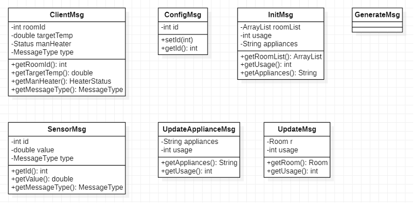

# Project Overview

The goal of the project is to simulate a smart home with its devices, its sensors and a user app using the Akka actor pattern to make the various part of the system communicate to each other. The user app allows not only to see the state of the house but also to control some parameters.

# Java objects

**Room**: object that actually contains the state of a room with its own id, power usage, temperature, target temperature and status of both light and conditioning unit.

**Appliance**: object that contains the appliance status with a description (which appliance is, etc.), its power usage and its status.

**MessageType**: enumeration that lists the type of messages possible.

**Status**: enumeration that lists the various statuses that the appliances of the house can assume.

**Sensor**: super class that identifies the sensors. It has an id useful to link the sensor to the specific room or appliance of the house and a reference to the server used to send messages to it.

**RunnableSensor**: class that implements the Runnable interface. Has a list of sensor (having only one type between ApplianceSensor, LightSensor, ConditioningSensor) and an interval. When the thread is started it sends a generateMsg to each sensor in the list and then sleep for `interval` seconds.

**ClientActor**: it represents the client. It sends a message to the server when the user wants to change some preference and receives data from the server. Each time it receives something from the server it updates its GUI.

**GUI**: simple GUI realized with java swing, it is updated through its two update method, the first one used when a room changes its state, the second one instead is used when an appliance changes its state. Its organized in three different panels: one panels which grows with the number of rooms and displays the information about the state of the room and the appliances, a second panel which allows the user to interact with the server and finally the third panel which contains only the information about the total power consumption.

**RoomManager**: it is the server of the architecture. It manages all the rooms and the appliances, it initializes them and updates them whenever a message arrives. It also has a reference to the client used to send to it the update messages. With the send methods it sends the information about rooms/appliances to the client along with the current total power usage of the house calculated with the `getTotalUsage` method.

# Actors

Three actor systems have been created. The first one manages all the sensors, the second one manages all the rooms of the house an the various appliances and finally the third actor system manages the client with its GUI. All the actors have been configured to communicate through TCP by loading the configuration from their own conf file at start up.

The sensor actor systems is firstly initialized by SensorMain, then load the configurations from the file `conf_Sensor`. After that creates three list of sensor, one for the conditioning units, one for the lights and one for the appliances of the house. Finally for each list of sensor starts a new thread, this allows all the different types of sensors (one type correspond to one list) to start generating the output even with different time intervals.

The client actor systems is initialized by ClientMain and loads the configurations from the file `conf_Client`. After that it sends to itself a configuration message that serves the purpose of connecting to the server and obtaining from it the initial information about the state of the house (the server replies with another message that is explained later in the document). Once the server has replied the client starts a simple GUI to show the status of the house and allows the user to interact with the server.

The server actor systems is initialized by ServerMain, loads the configurations from the file `conf_Server` and starts listening on the port 6123.

# Messages

The three actors uses different types of messages to communicate, below are explained the details of each message.

**ClientMsg**: message sent from the client to the server in two different moments: when turning off or setting to automatic the mode of the conditioning unit and when changing the target temperature of a room. The two options are distinguished at server side by reading the attribute messageType. After receiving this message the server updates the status of room indicated by the `id` with the new values.

**ConfigMsg**: message sent from SensorMain to the sensor actors when they are initialized. The `id` is used to differentiate the various instance of the actors and to link the sensor to each room/appliance.

**GenerateMsg**: message sent from one of the sensor threads to the sensor actors of its list when a new value has to be generated.

**InitMsg**: message sent from the client to server after its configuration is complete; in this case the attributes inside the message are set to `NULL`. This message is also sent from the server to the client as reply to the `InitMsg` received from the client; in this case the values of the attributes corresponds to the actual status of the house.

**SensorMsg**: message sent from the sensors to the server when a new value has been generated. The `id` is used to assign the new value to the right room or appliance. The attribute `messageType` is used server side to distinguish between light, heat or appliance sensor. After receiving this message the server updates the status of the room or appliance indicated by the `id` with the new value contained in `value`.

**UpdateApplianceMsg**: message sent from server to client when the status of an appliance has changed. Once received by the clients, it updates its GUI to reflect the changes in the status of the various appliances of the house.

**UpdateMsg**: message sent from server to client when the status of a room has changed. Once received by the clients, it updates its GUI to reflect the changes in the status of the house.

# Persistance and Failure Recovery

The server must recover from failure without losing its state. To achieve this the server saves its state on a log file, and after the restart recovers its previous state by reading that file.

The supervisor that restarts the server after a failure has been configured to do a maximum of 5 retries per minute.
